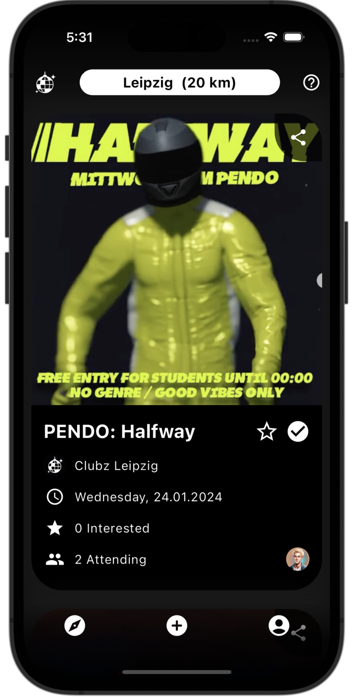

# Clubz

Clubz - A Cross Platform Social Network App for Events

## Notes

This repository serves as a parent for the front- and backend of the Clubz App.

## Live Version

To discover and install the live version of the app, visit:

- [App Store](https://apps.apple.com/en/app/clubz/id6444685917)
- [Google Play](https://play.google.com/store/apps/details?id=com.m_to_b.clubz)
- [Web](https://clubz.one)

## Features

### Profiles
- Users can create a profile and follow other users.
- Profiles can be public or private, depending on who should see the profile activity
- Private profiles first have to accept follow requests, while public profiles accept them automatically and are visible to every user by default
- Users can upload a custom profile picture, choose a unique username and set a display name
- Profile pages display all profile information, including a follower count, a count of created events, a score for app usage and the profiles upcoming and past events 
- Users can view the created and attended events of the profiles they follow (and public profiles)

### Events
- Users can create events and share them with their  followers or other social media
- Various information can be added to events, including  name, image, start and end time, location, description and highlighted key information like dress code, ticket prices and age policy
- Users can choose to list their created events in their profile, while listed events by public profiles are visible to all users of the app
- Users can express their interest by attending or saving events, which can then be viewed by their followers 

### Feed
- Users get a personalized view of relevant events in their feed, depending on their location, the current time and the profiles they follow
- The feed can be filtered by city and radius

## App Security
- Permissions and rules for individual users (like which profiles and events a user can view and query) are managed by custom row level security rules for Supabase and Postgres

## Screenshots

